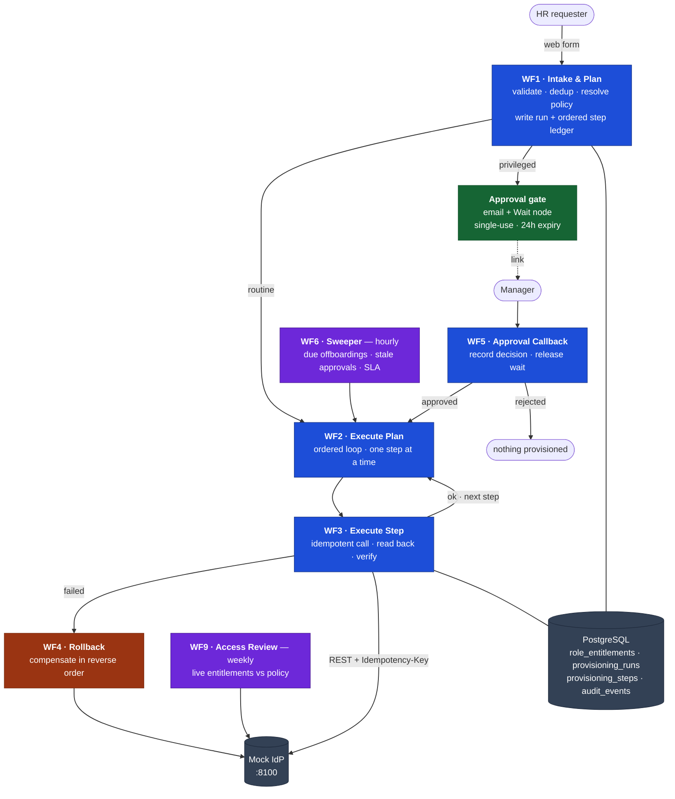
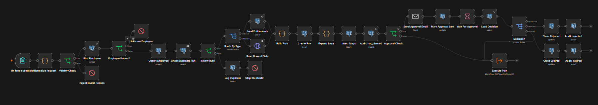

# JML Orchestrator

**Employee joiner/mover/leaver provisioning, built as eight n8n workflows over PostgreSQL.**
A request becomes a policy-derived plan, privileged grants pause for a human,
every step executes idempotently and is verified by reading the target system
back, and any partial failure is compensated in reverse order.

> **This is a working demonstration, not a deployment.** The identity provider in
> `mock-idp/` is a simulator written for this project. All employee data is
> synthetic. It has never run in a company. What is real is the behaviour under
> failure, and the evidence for each claim is stated below rather than implied.

---

## The problem

When someone joins, IT creates an account, adds groups, assigns licences, and
ticks off a checklist across several admin consoles. When someone leaves, all of
it has to come back off, the same day. Done by hand, steps get skipped. A skipped
revocation is a security hole that nobody notices until an audit.

The hard part is not calling the APIs. It is that **the APIs fail halfway**. A
half-provisioned account is worse than none, because nobody knows it exists.

---

## Architecture



*Source: [`docs/architecture.mmd`](docs/architecture.mmd). A rendered PNG for
contexts that don't support mermaid is at
[`docs/screenshots/00-architecture.png`](docs/screenshots/00-architecture.png).*

| # | Workflow | Trigger | Job |
|---|---|---|---|
| WF1 | Intake & Plan | Web form | Validate, dedup, derive plan from policy, gate, dispatch |
| WF2 | Execute Plan | Sub-workflow | Ordered loop; decides rollback |
| WF3 | Execute Step | Sub-workflow | One idempotent side effect plus its verification |
| WF4 | Rollback | Sub-workflow | Compensate succeeded steps in reverse |
| WF5 | Approval Callback | Webhook | Record the decision, release the paused run |
| WF6 | Sweeper | Hourly | Due offboardings, stale approvals, SLA breaches |
| WF7 | Error Handler | Error trigger | Central failure logging and alerting |
| WF9 | Access Review | Weekly | Report entitlement drift; does not remediate |



*WF1: validation, duplicate detection, onboard/offboard routing, plan
construction, approval gate, dispatch. Remaining canvases are in
[`docs/screenshots/`](docs/screenshots).*

---

## Reliability properties, and the evidence for each

| Property | Mechanism | Evidence |
|---|---|---|
| Duplicate requests cannot double-provision | `idempotency_root` UNIQUE column plus a pre-check | Observed: resubmission is refused by the ledger |
| Retries cannot double-apply | Deterministic per-step `Idempotency-Key` sent to the IdP | Observed: replays return `x-idempotent-replay: true` and change nothing |
| A 2xx response is not trusted | Every step reads the target system back and asserts the intended effect | Observed: a write reporting success that changed nothing is marked `failed` |
| Partial failure leaves no orphan state | Reverse-order compensating saga over the step ledger | Observed: a mid-plan failure deletes the account it created |
| Un-cleanable failure is never silent | `rolled_back` and `failed` are distinct terminal states, with an alert on the second | Specified and implemented; not yet exercised (F11) |
| Privileged access requires a human | `is_privileged` on the policy row plus a Wait-node gate | Observed: nothing provisioned until the link is clicked |
| Approval is single-use | Token nulled on first use; four validation conditions on the callback | Observed: second click returns 410 |
| Approval is time-bounded | 24-hour expiry checked on the callback and on Wait timeout | Specified and implemented; not yet exercised (F7) |
| Scheduled jobs cannot repeat side effects | `NOT EXISTS` guard plus `ON CONFLICT DO NOTHING` | Observed: four sweeper runs produce exactly one offboarding |
| One bad record cannot abort a batch | Missing accounts emit a zero-step plan instead of throwing | Observed: a due employee with no account is audited and skipped |
| Granted access is re-checked, not assumed | Weekly diff of live entitlements against policy | Observed: access granted outside the system is reported as `excess_access` |

Two queries in `db/audit_queries.sql` are **controls** and must always return
zero rows: nothing privileged provisioned without a recorded approval, and
nothing marked succeeded that the read-back could not confirm.

**On evidence.** "Observed" means the behaviour was exercised repeatedly during
development. Two rows are marked as specified but not yet exercised, rather than
implied. [`docs/failure-tests.md`](docs/failure-tests.md) holds an eleven-scenario
runbook with expected behaviour written per scenario, ready to execute and record.

---

## Where AI is, and deliberately is not

**There is currently no LLM anywhere in this system.** That is the design, not an
omission.

| Decision | Why it is not a model's job |
|---|---|
| What entitlements a role receives | A policy table. Auditable, diffable, reviewable by a security team. A prompt is none of those. |
| Whether approval is required | A boolean on the policy row. A model that is 99% right here is 1% catastrophic. |
| Whether a step succeeded | Read back from the IdP and compared. Never inferred. |
| What to roll back | A static inverse map. Rollback runs when things are already broken; it must be the most boring code in the system. |

One AI feature is designed and documented in
[`docs/04-stage3-ai.md`](docs/04-stage3-ai.md) but **not built**: parsing a
free-text HR email into a *proposed* request. Its output would become a
pre-filled form URL that a human submits, so the model could never provision
anything directly. Knowing where not to put a model is the point.

---

## Limitations

Stated plainly, because a reviewer will find them anyway.

- **The approval link proves possession of the link, not identity.** `approved_by`
  records `link-holder@<ip>`, which is exactly what is known. Production needs
  SSO in front of the callback endpoint, recording the authenticated subject.
- **Webhook URLs point at `localhost`**, so approval links are not clickable from
  a mail client on another machine. Production needs a public HTTPS URL and
  inbound signature verification.
- **One target system.** A single IdP lets the plan/execute separation look real
  without proving it. A second target would.
- **Work emails are derived from names with no collision handling.**
- **n8n runs single-process with SQLite for its own state.** Queue mode with
  Redis and Postgres is the first change needed for concurrency.
- **Execution data is retained indefinitely** and contains employee records.
- **Reviewed but not remediated.** The access review reports drift and
  deliberately does not act on it, because a bug in the diff would otherwise
  revoke production access on a Monday morning.
- **The failure suite is specified but not yet formally executed.**

---

## Operational notes learned by running it

- **Neon's free tier scales compute to zero.** The first connection after an idle
  period can exceed n8n's startup database ping timeout, and n8n activates
  workflows during that window. The result is an n8n that serves `/healthz` fine
  while every webhook and form URL returns 404. Wake the database with any query
  before starting n8n, then verify with
  `curl.exe -s -o NUL -w "%{http_code}" http://localhost:5678/form/jml-request`
  rather than trusting the editor loading.
- **n8n executes a node once per incoming item.** Any node after a loop's `done`
  output that should act once needs **Execute Once**, or you get one email per item.
- **`$('Node').all()` after a loop returns the last iteration only.** Aggregate by
  writing each result to `audit_events` inside the loop and summarising with SQL.
- **Postgres node operation matters.** `Insert` for audit rows with `id` left
  unmapped, `Update` with `id` both mapped and set as the match column, and
  `Insert or Update` for exactly one node.
- **`$json` silently changes meaning** when you insert a node upstream. Reference
  source nodes by name.

---

## Repository

```
db/schema.sql               employees · role_entitlements · provisioning_runs
                            provisioning_steps · audit_events · v_run_summary
db/seed_entitlements.sql    the entitlement policy for six roles
db/audit_queries.sql        audit and control queries, incl. the two zero-row controls
workflows/*.json            the eight workflows, exported for version control
mock-idp/main.py            FastAPI identity-provider simulator: API-key auth,
                            Idempotency-Key replay, 429s, injectable faults
mock-idp/test_mock_idp.py   self-check for the simulator
scripts/start-all.ps1       launches the IdP and n8n in their own windows
scripts/idp.ps1             PowerShell wrappers for the IdP (see below)
scripts/reset-demo.ps1      returns the demo to a clean slate
docs/00..07                 the full stage-by-stage build guide
docs/failure-tests.md       eleven-scenario failure runbook
```

## Quick start

```bash
npm install -g n8n
```

```bash
cd "D:\Claude Local\jml-orchestrator"; powershell -ExecutionPolicy Bypass -File .\scripts\start-all.ps1
```

n8n comes up at `http://localhost:5678`, the IdP at `http://127.0.0.1:8100/docs`.
n8n's first start runs migrations and takes one to three minutes, during which the
browser will say "Unable to connect". Then follow
[`docs/01-setup.md`](docs/01-setup.md) from §0.3 for Neon, credentials and schema.

Restore the workflows into a fresh n8n with:

```bash
n8n import:workflow --separate --input=workflows/
```

Credentials are not in the export, only references by name: `JML Postgres`,
`JML SMTP`, `Mock IdP Key`, `JML Gemini`.

## PowerShell users: load the IdP helpers

The `curl` examples in `docs/` are bash-style. Any that send a JSON body fail on
PowerShell 5.1, which mangles the escaped quotes and hands curl the JSON as a
second URL. Load the wrappers once per session:

```bash
cd "D:\Claude Local\jml-orchestrator"; . .\scripts\idp.ps1
```

| Instead of | Use |
|---|---|
| `POST /admin/reset` | `Reset-Idp` |
| `GET /v1/users` | `Get-IdpUsers` |
| `GET /v1/users/{email}` | `Get-IdpUser ada.lovelace@demo-corp.test` |
| `POST /admin/chaos` | `Set-Chaos fail_action assign_license 50` / `Set-Chaos off` |
| manual group grant | `Grant-Group grace.hopper@demo-corp.test prod-admin` |
| `GET /admin/state` | `Get-IdpState` |

## The mock identity provider is a simulator

`mock-idp/` is a FastAPI service written for this project. It is not a real
identity provider and does not talk to one. It exists so the orchestration logic
can be built and failure-tested against something that behaves like a vendor API:
API-key auth, `Idempotency-Key` with response replay, `429` with `Retry-After`,
and an `/admin/chaos` endpoint that injects failures on demand.
